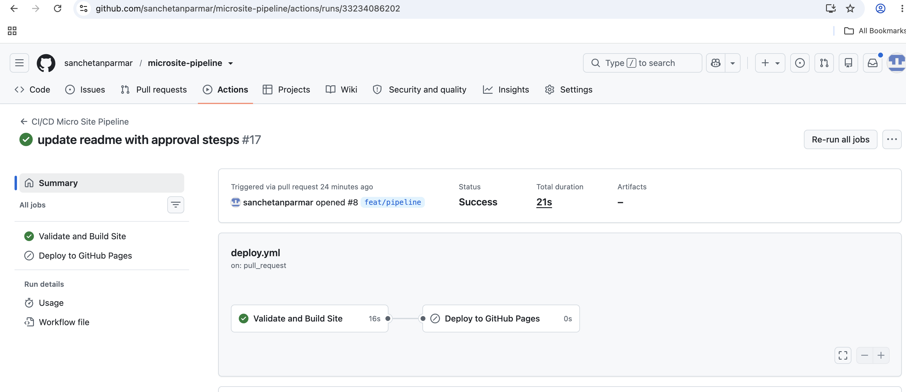
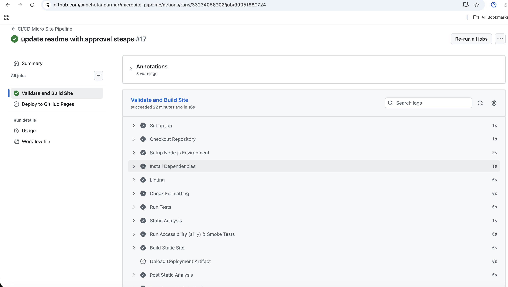
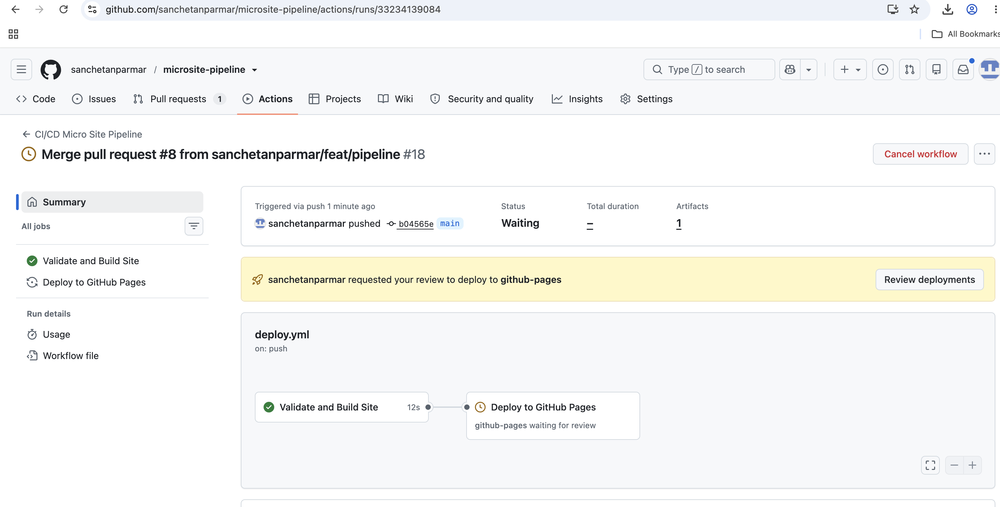
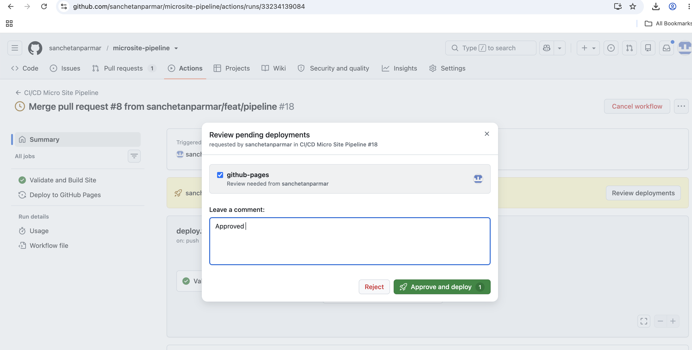
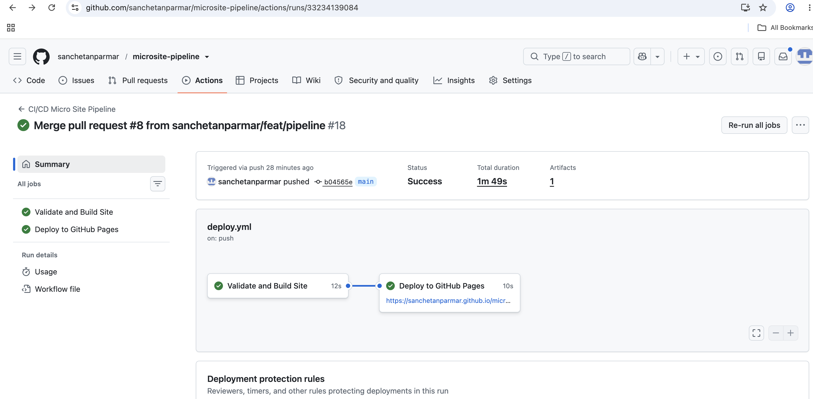

# GitHub Actions Micro Site CI/CD
### NOTE-  Node.js and the package.json / package-lock.json files with test values are included only to show a complete CI/CD pipeline with the requested stages.

Workflow YAML file 
```yaml
name: CI/CD Micro Site Pipeline

on:
  pull_request:
    branches:
      - main
  push:
    branches:
      - main

# default permissions
permissions:
  contents: read

jobs:
  validate_and_build:
    name: Validate and Build Site
    runs-on: ubuntu-latest
    
    steps:
      - name: Checkout Repository
        uses: actions/checkout@v4

      - name: Setup Node.js Environment
        uses: actions/setup-node@v4
        with:
          node-version: '20'
          cache: 'npm'

      - name: Install Dependencies
        run: npm ci

      - name: Linting
        run: npm run lint

      - name: Check Formatting 
        run: npm run format:check

      - name: Run Tests
        run: npm test

      - name: Static Analysis
        uses: actions/checkout@v6
        with:
         config: p/javascript

      - name: Run Smoke Tests
        run: npm run test:smoke

      - name: Build website
        run: |
          mkdir -p dist
          cp index.html dist/
          
      - name: Upload Deployment Artifact
        if: github.event_name == 'push' && github.ref == 'refs/heads/main'
        uses: actions/upload-pages-artifact@v3
        with:
          path: './dist'


  deploy:
    name: Deploy to GitHub Pages
    needs: validate_and_build
    if: github.event_name == 'push' && github.ref == 'refs/heads/main'
    runs-on: ubuntu-latest
    
    environment:
      name: github-pages
      url: ${{ steps.deployment.outputs.page_url }}
      
    permissions:
      contents: read
      pages: write
      id-token: write

    steps:
      - name: Deploy to GitHub Pages
        id: deployment
        uses: actions/deploy-pages@v4
```


## Repository Structure

```text
├── .github/workflows/deploy.yml  # GitHub Actions CI/CD Pipeline configuration
├── index.html                    # Main page
└── package.json                  # Node.js project dependencies
```

## CI/CD Workflow

The workflow is triggered by two events.

### Pull Request

When a pull request is opened or updated against `main`:

```text
Pull Request
     ↓
Checkout
     ↓
Setup Node.js
     ↓
npm ci
     ↓
Lint
     ↓
Tests
     ↓
Build
     ↓
```

The website is **not deployed** from a pull request.

### Push to main

When changes are merged into `main`:

```text
Push to main
     ↓
Checkout
     ↓
Setup Node.js
     ↓
npm ci
     ↓
Lint
     ↓
Tests
     ↓
Build
     ↓
Upload Artifact
     ↓
Deploy to GitHub Pages
```

Deployment only happens after the build and test job succeeds.

## Node.js Setup 
The workflow uses:

```yaml
- name: Setup Node.js Environment
  uses: actions/setup-node@v4
  with:
    node-version: '20'
    cache: 'npm'
```

Dependencies installation:

```bash
npm ci
```
## Build - creates a dist directory and copy files to dist 
```bash
mkdir -p dist
cp index.html dist/
```

## Testing

The pipeline performs basic validation before deployment.

### Lint

```bash
npm run lint
```

### Automated tests

```bash
npm test
```

If any required file is missing, the workflow fails.

## GitHub Pages Deployment

The generated `dist/` directory is uploaded using:

```yaml
uses: actions/upload-pages-artifact@v3
```

The deployment is handled by a separate job:

```yaml
uses: actions/deploy-pages@v4
```

The deployment job depends on the successful completion of the build and test job:

```yaml
needs: build-and-test
```

## Security and Permissions

The default workflow permission is:

```yaml
permissions:
  contents: read
```

The deployment job requires additional permissions:

```yaml
permissions:
  contents: read
  pages: write
  id-token: write
```

## GitHub Pages Environment

The deployment uses the:

```text
github-pages
```

environment.

```yaml
environment:
  name: github-pages
  url: ${{ steps.deployment.outputs.page_url }}
```

This provides deployment history and allows environment protection controls to be configured if required.

## GitHub Repository Configuration

Enable GitHub Pages:

```text
Repository
  → Settings
  → Pages
  → Build and deployment
  → Source
  → GitHub Actions
```

## Failure Protection

Deployment is separated from validation.

If any of the following fail:

```text
npm ci
Lint
Tests
Build
```

the deployment job will not run.

## Evidence of a Successful Pipeline

The pipeline can be demonstrated with the following evidence:

### Pull Request

Show:

```text
✓ Checkout
✓ Node.js setup
✓ npm ci
✓ Lint
✓ Tests
✓ Build
✓ Validation
```

and confirm that no deployment occurs.

### Workflow jobs 
Validate and Build Site and Deploy to GitHub Pages


1. *Validation* Job on Pull request to `main`


2. Deploy to GitHub Pages
Deploymnet job on Push to `main` Need to approve by someone 


Approval - 


After Deployment - 


## Deployment URL

After a successful deployment, the site will normally be available at:

```text
https://sanchetanparmar.github.io/microsite-pipeline/